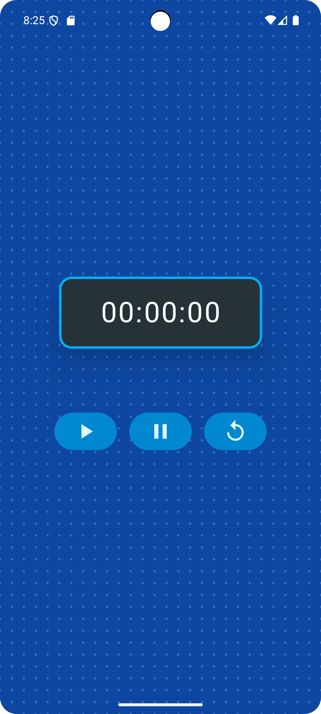
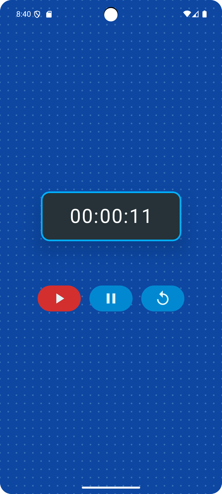
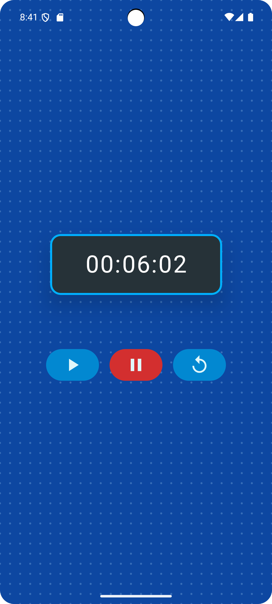
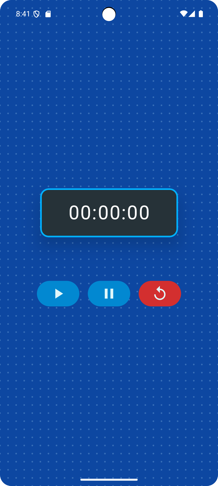

# ⏱️ StopwatchApp (Jetpack Compose)

A minimal yet visually engaging **stopwatch app** built using **Jetpack Compose**. The app features a modern UI with animated controls, custom styling, and responsive feedback for user interactions.

---

## ✨ Features

- ⏳ **Accurate Time Tracking**
  - Displays minutes, seconds, and milliseconds.
  
- 🎨 **Custom UI**
  - Dotted animated background.
  - Circular action buttons with icons.
  - Stylish card display for the clock.

- 🔴 **Interactive Feedback**
  - The last tapped button is highlighted in red.
  
- 🌙 **Dark & Sleek Theme**
  - Stylish dark card timer display with light text.

- 💡 **Composable Architecture**
  - Built with modular, reusable Jetpack Compose functions.

---

## 📸 Screenshots

<div align="center">
  
  
  <br>
  
  
</div>
---

## 🚀 Getting Started

1. Clone the repo:

   ```bash
   git clone https://github.com/your-username/StopwatchApp.git

2. Open in Android Studio
3. run the project on an emulator or device.

## Built With

  Kotlin

  Jetpack Compose

  Material 3

  MVVM architecture (ViewModel)

## 🤝 Contributing

Feel free to fork, enhance, and submit pull requests for improvements—animations, theming, or performance!
